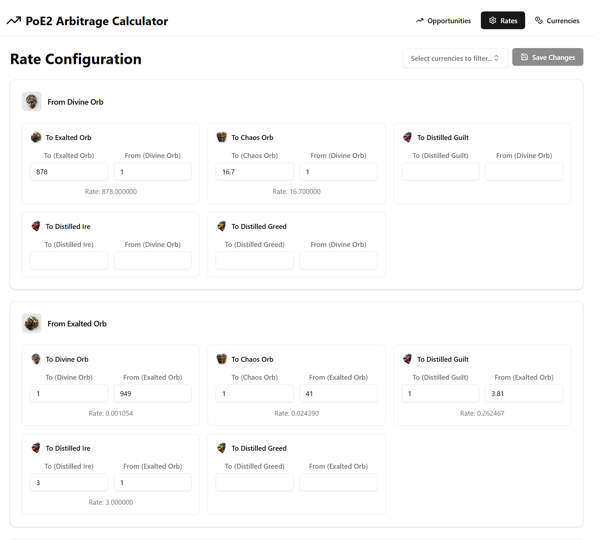
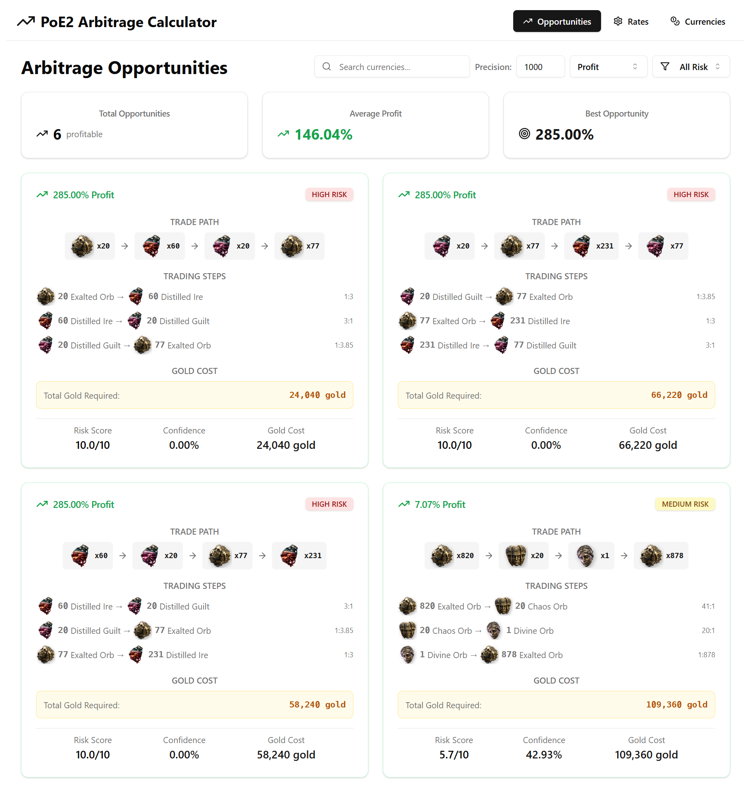

# Path of Exile 2 Arbitrage Calculator

A web-based arbitrage calculator designed for Path of Exile 2 currency trading. This tool helps players identify profitable trading opportunities by analyzing currency conversion rates and finding optimal trading paths.

## 📁 Folder Structure

```
arbitrage-calc/
├── public/                     # Static assets
├── src/
│   ├── components/            # React components
│   │   ├── app/              # Application-specific components
│   │   │   ├── IconDisplay.tsx
│   │   │   ├── IconPicker.tsx
│   │   │   └── iconConstants.ts
│   │   ├── ui/               # Reusable UI components (shadcn/ui)
│   │   ├── ArbitrageDashboard.tsx
│   │   ├── CurrencyManagement.tsx
│   │   ├── Navigation.tsx
│   │   └── RateConfiguration.tsx
│   ├── hooks/                # Custom React hooks
│   ├── lib/                  # Utility libraries
│   ├── types/                # TypeScript type definitions
│   ├── utils/                # Utility functions and helpers
│   │   ├── arbitrage.ts      # Core arbitrage calculation logic
│   │   └── storage.ts        # Local storage management
│   ├── App.tsx               # Main application component
│   ├── main.tsx              # Application entry point
│   └── index.css             # Global styles
├── components.json           # shadcn/ui configuration
├── package.json              # Dependencies and scripts
├── tailwind.config.js        # Tailwind CSS configuration
├── tsconfig.json             # TypeScript configuration
└── vite.config.ts            # Vite build configuration
```

## 🛠️ Main Dependencies and Technologies

### Core Technologies
- **React** - Frontend library for building user interfaces
- **TypeScript** - Type-safe JavaScript superset
- **Vite** - Fast build tool and development server
- **React Router DOM** - Client-side routing

### UI Framework & Styling
- **Tailwind CSS** - Utility-first CSS framework
- **Radix UI** - Low-level UI primitives for React
- **shadcn/ui** - Pre-built component library based on Radix UI
- **Lucide React** - Icon library

### Form Management & Validation
- **React Hook Form** - Form handling with minimal re-renders
- **Zod** - Schema validation library
- **Hookform Resolvers** - Form validation integration

### Development Tools
- **ESLint** - Code linting and style enforcement
- **Vitest** - Unit testing framework

## ✨ Main Features

### 🏦 Currency Management
- **Add Custom Currencies**: Create and manage Path of Exile 2 currencies with custom icons and gold cost values
- **Icon System**: Choose from a variety of predefined icons or use custom icons for currencies
- **Currency Validation**: Ensure all currencies have valid names and gold cost values
- **Bulk Operations**: Edit, update, and delete currencies with persistent storage

### ⚖️ Rate Configuration
- **Interactive Rate Input**: Configure conversion rates between any two currencies
- **Bidirectional Rates**: Set up both directions of currency conversion (A→B and B→A)
- **Rate Validation**: Real-time validation of conversion rates with visual feedback
- **Quantity-Based Input**: Input rates using specific quantity ratios (e.g., 5 Currency A = 3 Currency B)
- **Rate Statistics**: View total valid rates and possible rate combinations



### 📊 Arbitrage Dashboard
- **Opportunity Detection**: Automatically identify profitable 3-way arbitrage opportunities
- **Smart Filtering**: Filter opportunities by:
  - Currency search (find opportunities involving specific currencies)
  - Risk level (low, medium, high)
  - Profit thresholds
  - Confidence scores
- **Sorting Options**: Sort opportunities by profit, risk, or confidence
- **Detailed Analysis**: View complete trading paths with:
  - Step-by-step conversion quantities
  - Profit calculations
  - Risk assessments
  - Gold cost analysis
  - Confidence scores



### 🎯 Trading Path Optimization
- **Multi-Step Calculations**: Calculate optimal quantities for complex trading chains
- **Precision Control**: Adjustable precision settings for quantity calculations
- **Gold Cost Analysis**: Factor in gold costs for each currency transaction
- **Risk Assessment**: Evaluate risk scores based on profit margins and rate volatility

### 💾 Data Persistence
- **Local Storage**: All currencies and rates are automatically saved to browser storage
- **Data Integrity**: Automatic cleanup of invalid rates when currencies are deleted
- **Session Recovery**: Restore previous work when returning to the application

### 🎨 User Experience
- **Modern UI**: Clean, responsive design with dark/light theme support
- **Real-time Updates**: Instant recalculation of opportunities when rates change
- **Visual Feedback**: Color-coded risk indicators and profit highlights
- **Mobile Responsive**: Optimized for desktop and mobile usage
- **Intuitive Navigation**: Clean navigation between different sections

### 🔧 Advanced Features
- **Rate Matrix Building**: Efficient internal representation of currency conversion rates
- **Cycle Detection**: Identifies profitable circular trading paths
- **Confidence Scoring**: Algorithmic confidence assessment based on market conditions
- **Performance Optimization**: Memoized calculations for smooth user experience

## 🚀 Getting Started

1. **Install Dependencies**
   ```bash
   npm install
   ```

2. **Start Development Server**
   ```bash
   npm run dev
   ```

3. **Build for Production**
   ```bash
   npm run build
   ```

4. **Run Tests**
   ```bash
   npm run test
   ```

## 📈 How It Works

1. **Setup Currencies**: Add the Path of Exile 2 currencies you want to trade
2. **Configure Rates**: Input the current market conversion rates between currencies  
3. **Find Opportunities**: The calculator automatically identifies profitable arbitrage paths
4. **Execute Trades**: Follow the recommended trading sequence to maximize profits

The calculator uses advanced algorithms to detect triangular arbitrage opportunities, where you can profit by converting through a chain of currencies and ending up with more of your starting currency than you began with.

## Author

Mateus Junior ([juniormateusknd@gmail.com](mailto:juniormateusknd@gmail.com))

## License

This project is licensed under the MIT License.
